# Plan de Arquitectura e Implementación - Sierra Gorda SCM
## Asistente Virtual Inteligente

**Versión:** 1.0
**Fecha:** Noviembre 2025
**Proyecto:** Evolución de MVP a Solución Empresarial Completa

---

## 📋 Tabla de Contenidos

1. [Estado Actual (MVP)](#estado-actual-mvp)
2. [Arquitectura Objetivo](#arquitectura-objetivo)
3. [Componentes Técnicos](#componentes-técnicos)
4. [Plan de Implementación por Fases](#plan-de-implementación-por-fases)
5. [Gap Analysis](#gap-analysis)
6. [Roadmap y Timeline](#roadmap-y-timeline)
7. [Entregables](#entregables)

---

## 🎯 Estado Actual (MVP)

### ✅ Componentes Implementados

```
MVP Actual:
├── Bot de Microsoft Teams
│   ├── Activity Handler con manejo de eventos
│   ├── Adaptive Cards para UI rica
│   └── Dialog Manager para contexto
├── Azure OpenAI (GPT-4)
│   ├── Extracción de intenciones
│   └── Generación de respuestas
├── Azure Cognitive Search
│   └── Búsqueda semántica
├── Integración SAP Ariba
│   ├── Servicio MOCK para desarrollo
│   ├── Servicio REAL con OAuth2
│   └── Consultas: PO, PR, Proveedores
├── Azure Redis Cache
│   └── Cache de tokens y datos
└── Logging
    └── Application Insights básico
```

### 🔧 Funcionalidades Actuales

- ✅ Conversación en lenguaje natural
- ✅ ~6 tipos de consultas (PO, PR, Proveedores, Estado, Búsqueda)
- ✅ Autenticación automática vía Teams/Entra ID
- ✅ Adaptive Cards básicas
- ✅ Modo Mock para desarrollo
- ✅ Cache con TTL

### ❌ Faltante para Cumplir Requerimientos

- ❌ 24+ tipos de consultas adicionales
- ❌ Visualización de gráficos e indicadores
- ❌ Generación y envío de archivos (PDF, Excel)
- ❌ Notificaciones automáticas
- ❌ Interfaz web (URL)
- ❌ Power BI integrado
- ❌ Azure Functions para automatización
- ❌ Azure API Management
- ❌ Panel de administración
- ❌ Analítica y reportes mensuales
- ❌ RPA para sistemas sin API

---

## 🏗️ Arquitectura Objetivo

### Diagrama de Arquitectura Completa

```mermaid
graph TB
    subgraph "Usuarios"
        U1[👤 Usuario Teams]
        U2[👤 Usuario Web]
        U3[👤 Usuario Móvil]
    end

    subgraph "Canales de Acceso"
        Teams[Microsoft Teams<br/>Canal Principal]
        WebApp[Web App<br/>React/Blazor]
        Mobile[Teams Mobile]
    end

    subgraph "Azure Bot Service"
        BotFramework[Bot Framework<br/>Adapter]
        TeamsBot[Teams Bot<br/>Activity Handler]
        WebChat[Web Chat<br/>Connector]
    end

    subgraph "Capa de Aplicación"
        DialogMgr[Dialog Manager<br/>Contexto & Estado]
        MessageHandler[Message Handler<br/>Router de Intenciones]
        NotificationService[Notification Service<br/>Alertas Proactivas]
    end

    subgraph "Capa de Inteligencia"
        AzureOpenAI[Azure OpenAI GPT-4<br/>NLU & NLG]
        PromptMgmt[Prompt Management<br/>Versionamiento]
        IntentRecog[Intent Recognition<br/>30+ Intenciones]
    end

    subgraph "Azure API Management"
        APIM[API Gateway<br/>Rate Limiting & Security]
        APIMPolicies[Políticas<br/>Throttling, Auth, Logs]
    end

    subgraph "Servicios de Negocio - Azure Functions"
        F1[PO Queries<br/>Function]
        F2[PR Queries<br/>Function]
        F3[Invoice Queries<br/>Function]
        F4[Supplier Queries<br/>Function]
        F5[Contract Queries<br/>Function]
        F6[Payment Queries<br/>Function]
        F7[Report Generation<br/>Function]
        F8[Chart Generation<br/>Function]
        F9[Alert Scheduler<br/>Timer Function]
        F10[Data Sync<br/>RPA Orchestrator]
    end

    subgraph "Integración de Datos"
        AribaSvc[SAP Ariba Service<br/>OAuth2 + REST]
        RPAOrch[RPA Orchestrator<br/>Power Automate]
        SAPConnector[SAP Connector<br/>APIs/OData]
        EmailSvc[Email Service<br/>SendGrid/Graph API]
    end

    subgraph "Sistemas Externos"
        Ariba[(SAP Ariba<br/>PO, PR, Suppliers)]
        SAP[(SAP ERP<br/>Financials)]
        SharePoint[(SharePoint<br/>Documentos)]
        Email[Exchange Online<br/>Email Corporativo]
    end

    subgraph "Almacenamiento de Datos"
        CosmosDB[(Cosmos DB<br/>Conversaciones & Logs)]
        BlobStorage[(Blob Storage<br/>Archivos & Reportes)]
        CogSearch[(Cognitive Search<br/>Knowledge Base)]
        Redis[(Redis Cache<br/>Sesiones & Tokens)]
    end

    subgraph "Análisis y Visualización"
        PowerBI[Power BI Service<br/>Dashboards]
        AppInsights[Application Insights<br/>Telemetría]
        LogAnalytics[Log Analytics<br/>Queries & Alerts]
    end

    subgraph "Seguridad y Gobierno"
        EntraID[Microsoft Entra ID<br/>SSO & RBAC]
        KeyVault[Azure Key Vault<br/>Secretos & Certificados]
        Sentinel[Azure Sentinel<br/>Seguridad & Auditoría]
    end

    subgraph "Administración"
        AdminPanel[Panel Admin<br/>Configuración & Monitoreo]
        UserMgmt[Gestión Usuarios<br/>Permisos & Roles]
    end

    %% Conexiones de Usuarios
    U1 --> Teams
    U2 --> WebApp
    U3 --> Mobile

    Teams --> BotFramework
    WebApp --> WebChat
    Mobile --> BotFramework

    BotFramework --> TeamsBot
    WebChat --> TeamsBot

    TeamsBot --> DialogMgr
    TeamsBot --> NotificationService

    DialogMgr --> MessageHandler
    MessageHandler --> IntentRecog
    IntentRecog --> AzureOpenAI

    MessageHandler --> APIM
    APIM --> F1
    APIM --> F2
    APIM --> F3
    APIM --> F4
    APIM --> F5
    APIM --> F6
    APIM --> F7
    APIM --> F8

    F1 --> AribaSvc
    F2 --> AribaSvc
    F3 --> AribaSvc
    F4 --> AribaSvc
    F5 --> RPAOrch
    F6 --> SAPConnector
    F7 --> BlobStorage
    F8 --> PowerBI

    F9 --> NotificationService
    F10 --> RPAOrch

    AribaSvc --> Ariba
    SAPConnector --> SAP
    RPAOrch --> SharePoint
    EmailSvc --> Email

    NotificationService --> Teams
    NotificationService --> EmailSvc

    %% Almacenamiento
    DialogMgr --> CosmosDB
    DialogMgr --> Redis
    MessageHandler --> CogSearch
    F7 --> BlobStorage

    %% Análisis
    TeamsBot --> AppInsights
    APIM --> LogAnalytics
    AppInsights --> PowerBI

    %% Seguridad
    BotFramework -.Auth.-> EntraID
    WebChat -.Auth.-> EntraID
    APIM -.Secrets.-> KeyVault
    AppInsights --> Sentinel

    %% Admin
    AdminPanel --> UserMgmt
    AdminPanel --> PowerBI
    AdminPanel --> LogAnalytics

    style AzureOpenAI fill:#0078D4,color:#fff
    style Teams fill:#6264A7,color:#fff
    style PowerBI fill:#F2C811,color:#000
    style EntraID fill:#00BCF2,color:#fff
    style Ariba fill:#00A1E0,color:#fff
```



---

## 🔧 Componentes Técnicos

### 1. Frontend y Canales

#### 1.1 Microsoft Teams (Canal Principal)
- **Componente**: Azure Bot Service + Bot Framework SDK
- **Estado**: ✅ Implementado (básico)
- **Mejoras Necesarias**:
  - Adaptive Cards avanzadas con acciones interactivas
  - Task Modules para formularios complejos
  - Tabs personalizadas para dashboards embebidos
  - Notificaciones proactivas con triggers

#### 1.2 Interfaz Web (URL Segura)
- **Componente**: Web App Service + Web Chat SDK
- **Estado**: ❌ No implementado
- **Stack Propuesto**:
  - **Frontend**: React o Blazor Server
  - **Autenticación**: Microsoft Entra ID (MSAL)
  - **Web Chat**: Bot Framework Web Chat SDK
  - **Hosting**: Azure App Service (Linux)
- **Características**:
  - Diseño responsivo (mobile-first)
  - Persistencia de conversaciones
  - Historial de interacciones
  - Descarga de archivos generados

#### 1.3 Móvil
- **Componente**: Teams Mobile App
- **Estado**: ✅ Funciona con Teams (básico)
- **Mejoras**: Optimización de Adaptive Cards para móvil

---

### 2. Inteligencia Artificial y NLP

#### 2.1 Azure OpenAI Service
- **Modelo**: GPT-4 / GPT-4 Turbo
- **Estado**: ✅ Implementado (básico)
- **Evolución Necesaria**:
  - **Prompt Engineering Avanzado**:
    ```
    prompts/
    ├── system_prompts/
    │   ├── general_assistant.txt
    │   ├── procurement_specialist.txt
    │   └── report_generator.txt
    ├── few_shot_examples/
    │   ├── po_queries.json
    │   ├── invoice_queries.json
    │   └── supplier_queries.json
    └── templates/
        ├── email_templates/
        └── report_templates/
    ```
  - **Function Calling** para 30+ intenciones
  - **Embeddings** para búsqueda semántica mejorada
  - **Versionamiento de prompts** con A/B testing

#### 2.2 Intent Recognition (30+ Intenciones)
```javascript
// Intenciones Mapeadas
const INTENTS = {
  // Órdenes de Compra (6)
  'search_po': 'Buscar PO por número',
  'list_pos': 'Listar POs recientes',
  'po_by_supplier': 'POs por proveedor',
  'po_by_status': 'POs por estado',
  'po_by_date': 'POs por fecha',
  'po_summary': 'Resumen de POs',

  // Purchase Requisitions (6)
  'search_pr': 'Buscar PR',
  'list_prs': 'Listar PRs',
  'pr_by_requester': 'PRs por solicitante',
  'create_pr': 'Crear nueva PR',
  'pr_approval_status': 'Estado de aprobación PR',
  'pr_summary': 'Resumen de PRs',

  // Facturas (5)
  'search_invoice': 'Buscar factura',
  'invoice_status': 'Estado de factura',
  'invoice_by_supplier': 'Facturas por proveedor',
  'pending_invoices': 'Facturas pendientes',
  'invoice_summary': 'Resumen de facturas',

  // Pagos (4)
  'payment_status': 'Estado de pago',
  'pending_payments': 'Pagos pendientes',
  'payment_history': 'Historial de pagos',
  'payment_forecast': 'Proyección de pagos',

  // Proveedores (4)
  'search_supplier': 'Buscar proveedor',
  'supplier_performance': 'Performance de proveedor',
  'supplier_list': 'Listar proveedores',
  'supplier_contracts': 'Contratos de proveedor',

  // Contratos (3)
  'search_contract': 'Buscar contrato',
  'contract_expiry': 'Contratos por vencer',
  'contract_summary': 'Resumen de contratos',

  // Reportes y Analytics (5)
  'generate_report': 'Generar reporte',
  'spending_analysis': 'Análisis de gastos',
  'category_spending': 'Gastos por categoría',
  'supplier_spending': 'Gastos por proveedor',
  'kpi_dashboard': 'Dashboard de KPIs',

  // Notificaciones y Alertas (2)
  'configure_alert': 'Configurar alerta',
  'list_alerts': 'Mis alertas configuradas',

  // General (3)
  'help': 'Ayuda',
  'status': 'Estado del sistema',
  'general_question': 'Pregunta general'
};
```

#### 2.3 Azure Cognitive Search
- **Estado**: ✅ Implementado (básico)
- **Mejoras**:
  - Indexación de documentos (PDFs, Excel, Word)
  - Semantic Search con ranking
  - Custom skills para extracción de datos
  - Autocomplete y sugerencias

---

### 3. Capa de Servicios (Azure Functions)

#### 3.1 Microservicios Serverless

```
Azure Functions (Consumption Plan / Premium)
├── Purchase Orders Functions
│   ├── GetPurchaseOrders (HTTP)
│   ├── GetPOById (HTTP)
│   ├── GetPOsBySupplier (HTTP)
│   └── GetPOsSummary (HTTP)
├── Purchase Requisitions Functions
│   ├── GetPurchaseRequisitions (HTTP)
│   ├── CreatePR (HTTP)
│   ├── ApprovePR (HTTP)
│   └── GetPRStatus (HTTP)
├── Invoice Functions
│   ├── GetInvoices (HTTP)
│   ├── GetInvoiceStatus (HTTP)
│   └── GetPendingInvoices (HTTP)
├── Payment Functions
│   ├── GetPaymentStatus (HTTP)
│   ├── GetPendingPayments (HTTP)
│   └── GetPaymentForecast (HTTP)
├── Supplier Functions
│   ├── GetSuppliers (HTTP)
│   ├── GetSupplierPerformance (HTTP)
│   └── GetSupplierContracts (HTTP)
├── Contract Functions
│   ├── GetContracts (HTTP)
│   ├── GetExpiringContracts (HTTP)
│   └── GetContractSummary (HTTP)
├── Report Generation Functions
│   ├── GeneratePDFReport (HTTP)
│   ├── GenerateExcelReport (HTTP)
│   ├── GenerateChartImage (HTTP)
│   └── SendReportEmail (HTTP)
├── Analytics Functions
│   ├── GetSpendingAnalysis (HTTP)
│   ├── GetKPIDashboard (HTTP)
│   └── SyncPowerBIDataset (Timer)
└── Notification Functions
    ├── SendTeamsNotification (HTTP)
    ├── SendEmailNotification (HTTP)
    ├── ScheduledAlertsCheck (Timer)
    └── ProcessAlertQueue (Queue)
```

**Ventajas de Azure Functions**:
- ✅ Escalabilidad automática
- ✅ Pay-per-execution
- ✅ Fácil despliegue CI/CD
- ✅ Integración nativa con otros servicios Azure
- ✅ Versionamiento independiente

---

### 4. API Management

#### 4.1 Azure API Management (APIM)
- **Estado**: ❌ No implementado
- **Propósito**:
  - Gateway unificado para todas las Azure Functions
  - Rate limiting por usuario/rol
  - Autenticación y autorización centralizada
  - Transformación de requests/responses
  - Caching de APIs
  - Logging y monitoring

#### 4.2 Políticas APIM
```xml
<policies>
  <!-- Autenticación con Entra ID -->
  <inbound>
    <validate-jwt header-name="Authorization">
      <openid-config url="https://login.microsoftonline.com/{tenant}/.well-known/openid-configuration" />
      <audiences>
        <audience>api://{api-client-id}</audience>
      </audiences>
    </validate-jwt>

    <!-- Rate Limiting -->
    <rate-limit-by-key calls="100" renewal-period="60"
                       counter-key="@(context.Request.Headers.GetValueOrDefault("Authorization",""))" />

    <!-- Cache -->
    <cache-lookup vary-by-developer="true" vary-by-developer-groups="false" />
  </inbound>

  <backend>
    <forward-request />
  </backend>

  <outbound>
    <cache-store duration="60" />
  </outbound>
</policies>
```

---

### 5. Integración con Sistemas

#### 5.1 SAP Ariba Integration
- **Estado**: ✅ Implementado (OAuth2 + REST)
- **Evolución**:
  - Endpoints adicionales (facturas, contratos, pagos)
  - Webhook subscriptions para eventos en tiempo real
  - Bulk operations para reportes grandes

#### 5.2 RPA para Sistemas Legacy
- **Herramienta**: Power Automate Desktop + Cloud Flows
- **Casos de Uso**:
  - Sistemas sin API disponible
  - Descarga de reportes desde sistemas web internos
  - Extracción de datos de archivos compartidos
  - Procesos batch nocturnos

```yaml
# Ejemplo: RPA Flow para descarga de reportes
RPA Flow:
  Trigger: Timer (diario 2am)
  Steps:
    1. Login a sistema interno
    2. Navegar a sección de reportes
    3. Seleccionar filtros (fecha, tipo)
    4. Descargar archivo Excel
    5. Subir a Blob Storage
    6. Parsear datos y cargar a Cosmos DB
    7. Notificar completado
```

#### 5.3 SharePoint Integration
- **Propósito**: Almacenamiento y recuperación de documentos
- **APIs**: Microsoft Graph API
- **Casos de Uso**:
  - Contratos almacenados en SharePoint
  - Documentación de proveedores
  - Políticas y procedimientos

#### 5.4 Email Integration
- **Servicio**: Microsoft Graph API (Exchange Online)
- **Casos de Uso**:
  - Envío de reportes por email
  - Alertas críticas
  - Resúmenes semanales/mensuales

---

### 6. Almacenamiento y Datos

#### 6.1 Azure Cosmos DB
- **Estado**: ❌ No implementado
- **Propósito**: Base de datos NoSQL para:
  - Historial de conversaciones
  - Contexto de diálogos
  - Configuración de usuarios
  - Logs de auditoría
  - Configuración de alertas

**Modelo de Datos**:
```javascript
// Colección: Conversations
{
  "id": "conv-12345",
  "userId": "user@sgscm.com",
  "channelId": "msteams",
  "conversationId": "teams-conv-abc",
  "messages": [
    {
      "timestamp": "2025-11-06T10:30:00Z",
      "role": "user",
      "content": "Muéstrame las POs pendientes",
      "intent": "list_pos",
      "entities": { "status": "pending" }
    },
    {
      "timestamp": "2025-11-06T10:30:05Z",
      "role": "assistant",
      "content": "He encontrado 15 POs pendientes...",
      "data": { ... }
    }
  ],
  "metadata": {
    "startTime": "2025-11-06T10:30:00Z",
    "lastActivity": "2025-11-06T10:35:00Z",
    "department": "Procurement",
    "location": "Santiago"
  }
}

// Colección: UserSettings
{
  "id": "user@sgscm.com",
  "displayName": "Juan Pérez",
  "department": "Procurement",
  "role": "Buyer",
  "alerts": [
    {
      "type": "po_approval",
      "threshold": "> $50000",
      "channels": ["teams", "email"]
    }
  ],
  "preferences": {
    "language": "es-CL",
    "timezone": "America/Santiago",
    "defaultView": "summary"
  }
}

// Colección: Alerts
{
  "id": "alert-67890",
  "userId": "user@sgscm.com",
  "type": "contract_expiry",
  "condition": {
    "field": "expiryDate",
    "operator": "within",
    "value": "30 days"
  },
  "active": true,
  "lastTriggered": "2025-11-05T08:00:00Z",
  "frequency": "daily"
}
```

#### 6.2 Azure Blob Storage
- **Estado**: ❌ No implementado
- **Propósito**:
  - Reportes generados (PDF, Excel)
  - Gráficos e imágenes
  - Archivos temporales
  - Backups

**Estructura**:
```
Blob Containers:
├── reports/
│   ├── {year}/{month}/{userId}/
│   │   ├── spending_report_2025-11.pdf
│   │   └── po_summary_2025-11.xlsx
├── charts/
│   ├── {userId}/
│   │   └── spending_chart_abc123.png
├── templates/
│   ├── report_templates/
│   │   ├── monthly_summary.rdl
│   │   └── spending_analysis.xlsx
└── exports/
    └── data_exports/
        └── ariba_data_2025-11-06.json
```

#### 6.3 Redis Cache
- **Estado**: ✅ Implementado
- **Mejoras**:
  - Cache de resultados de queries frecuentes
  - Session state distribuido
  - Rate limiting counters

---

### 7. Generación de Reportes y Visualización

#### 7.1 Power BI Service
- **Estado**: ❌ No implementado
- **Componentes Necesarios**:
  - **Power BI Workspace** dedicado
  - **Datasets**:
    - Datos de Ariba (PO, PR, Invoices)
    - Datos de conversaciones (uso del bot)
    - Datos de satisfacción de usuario
  - **Reports**:
    - Dashboard ejecutivo (KPIs)
    - Análisis de gastos por categoría
    - Performance de proveedores
    - Uso del asistente (analytics)
  - **Power BI Embedded** en:
    - Teams (Tab personalizada)
    - Interfaz web
    - Reportes enviados por bot

#### 7.2 Chart Generation
- **Librería**: Plotly / Chart.js / QuickChart.io
- **Azure Function**: `GenerateChartImage`
- **Flujo**:
  ```
  Usuario: "Muéstrame gráfico de gastos por categoría"
  → Azure Function genera imagen PNG
  → Sube a Blob Storage
  → Retorna URL
  → Bot envía Adaptive Card con imagen
  ```

#### 7.3 PDF Generation
- **Librería**: Puppeteer / Playwright (Azure Function)
- **Templates**: Handlebars o Razor Pages
- **Flujo**:
  ```
  Usuario: "Genera reporte de POs del mes"
  → Azure Function:
    1. Obtiene datos de Ariba
    2. Renderiza template HTML
    3. Convierte a PDF con Puppeteer
    4. Sube a Blob Storage
    5. Retorna URL segura
  → Bot envía link de descarga
  ```

#### 7.4 Excel Generation
- **Librería**: EPPlus / ClosedXML
- **Casos de Uso**:
  - Exportar datos de tablas
  - Reportes detallados
  - Datos para análisis offline

---

### 8. Notificaciones y Alertas

#### 8.1 Notification Service
- **Componente**: Azure Function con Queue Storage
- **Canales**:
  - **Teams**: Bot Framework Proactive Messaging
  - **Email**: Microsoft Graph API

#### 8.2 Alert Scheduler
```python
# Azure Function - Timer Trigger (cron: 0 0 8 * * *)
def scheduled_alerts_check(timer):
    # 1. Obtener alertas activas de Cosmos DB
    alerts = cosmos_client.query_items(
        query="SELECT * FROM c WHERE c.active = true"
    )

    # 2. Por cada alerta, verificar condición
    for alert in alerts:
        if check_alert_condition(alert):
            # 3. Enviar notificación
            send_notification(
                user_id=alert['userId'],
                message=alert['message'],
                channels=alert['channels']
            )

            # 4. Actualizar última ejecución
            update_alert_timestamp(alert['id'])
```

#### 8.3 Tipos de Alertas Configurables
```yaml
Alert Types:
  - PO Approval Needed:
      Trigger: Nueva PO requiere aprobación
      Audience: Aprobadores
      Channels: Teams, Email

  - Contract Expiry:
      Trigger: Contrato vence en X días
      Audience: Contract Managers
      Channels: Teams, Email

  - Invoice Overdue:
      Trigger: Factura vencida sin pago
      Audience: Accounts Payable
      Channels: Teams, Email

  - Supplier Performance:
      Trigger: Rating del proveedor < threshold
      Audience: Procurement Lead
      Channels: Teams

  - Budget Threshold:
      Trigger: Gasto mensual > budget
      Audience: Finance, Procurement
      Channels: Teams, Email
```

---

### 9. Seguridad y Cumplimiento

#### 9.1 Microsoft Entra ID (Azure AD)
- **Estado**: ✅ Implementado (Teams auth)
- **Evolución**:
  - **RBAC** (Role-Based Access Control):
    ```
    Roles:
    ├── Admin: Acceso completo + panel admin
    ├── Procurement Manager: Todas las consultas + reportes
    ├── Buyer: Consultas PO/PR/Suppliers
    ├── Finance: Consultas facturas/pagos
    └── Viewer: Solo lectura
    ```
  - **Conditional Access** para interfaz web
  - **MFA** obligatorio para admin panel

#### 9.2 Azure Key Vault
- **Estado**: Parcialmente implementado
- **Secretos a Gestionar**:
  - Credenciales de Ariba (Client ID/Secret)
  - Connection strings (Cosmos DB, Redis, Storage)
  - API Keys (SendGrid, terceros)
  - Certificados SSL
  - Encryption keys

#### 9.3 Ley 19.628 - Protección de Datos Personales (Chile)
**Requerimientos de Cumplimiento**:

✅ **Consentimiento**:
- Mensaje inicial informando uso de datos
- Opción de opt-out de analítica (mantener funcionalidad)

✅ **Finalidad**:
- Datos usados solo para operación del asistente
- No compartir con terceros sin consentimiento

✅ **Seguridad**:
- Cifrado en tránsito (HTTPS/TLS)
- Cifrado en reposo (Azure Storage Encryption)
- Acceso restringido por RBAC

✅ **Derecho de Acceso**:
- Usuario puede solicitar ver sus datos
- Exportar historial de conversaciones

✅ **Derecho de Rectificación/Eliminación**:
- Usuario puede solicitar borrar sus datos
- Implementar función "Eliminar mi historial"

✅ **Auditoría**:
- Logs de acceso a datos personales
- Registro de quien accede a qué datos
- Retención de logs: 1 año mínimo

#### 9.4 Azure Sentinel (SIEM)
- **Propósito**: Detección de amenazas y análisis de seguridad
- **Casos de Uso**:
  - Detectar intentos de acceso no autorizado
  - Alertas de uso anómalo
  - Correlación de eventos de seguridad
  - Cumplimiento y auditoría

---

### 10. Panel de Administración

#### 10.1 Admin Portal
- **Tech Stack**:
  - **Frontend**: React + TypeScript
  - **UI Library**: Fluent UI (Microsoft Design)
  - **Backend**: Azure Functions (API)
  - **Auth**: Entra ID con rol "Admin"
  - **Hosting**: Azure Static Web Apps

#### 10.2 Funcionalidades del Panel

```
Admin Portal:
├── Dashboard General
│   ├── Uso del bot (# usuarios activos, # mensajes/día)
│   ├── Intenciones más consultadas
│   ├── Satisfacción promedio
│   └── Errores recientes
│
├── Gestión de Usuarios
│   ├── Lista de usuarios
│   ├── Asignar roles
│   ├── Ver historial de usuario
│   └── Deshabilitar/Habilitar acceso
│
├── Configuración de Prompts
│   ├── Editar system prompts
│   ├── Agregar/editar few-shot examples
│   ├── Versionamiento de prompts
│   └── A/B testing de prompts
│
├── Gestión de Intenciones
│   ├── Ver intenciones disponibles
│   ├── Agregar nueva intención
│   ├── Configurar function calling
│   └── Estadísticas por intención
│
├── Configuración de Alertas
│   ├── Templates de alertas
│   ├── Condiciones globales
│   └── Logs de alertas enviadas
│
├── Gestión de Knowledge Base
│   ├── Cargar documentos a Cognitive Search
│   ├── Re-indexar
│   ├── Ver índices
│   └── Estadísticas de búsqueda
│
├── Reportes y Analytics
│   ├── Exportar logs
│   ├── Generar reporte de uso
│   ├── Análisis de satisfacción
│   └── KPIs del sistema
│
├── Logs y Auditoría
│   ├── Logs de aplicación
│   ├── Logs de seguridad
│   ├── Auditoría de accesos
│   └── Historial de cambios
│
└── Configuración del Sistema
    ├── Variables de entorno
    ├── Feature flags
    ├── Rate limits
    └── Mantenimiento programado
```

---

## 📅 Plan de Implementación por Fases

### **FASE 1: Fundamentos y Expansión de Consultas** (Semanas 1-4)

#### Objetivos:
- ✅ Expandir de 6 a 30+ tipos de consultas
- ✅ Implementar Azure Functions para microservicios
- ✅ Configurar Azure API Management
- ✅ Implementar Cosmos DB para persistencia

#### Tareas:

**Semana 1-2: Azure Functions + APIM**
- [ ] Crear Function Apps para cada dominio (PO, PR, Invoices, Payments, Suppliers, Contracts)
- [ ] Implementar 30+ functions con lógica de negocio
- [ ] Configurar Azure API Management
- [ ] Definir políticas de seguridad y rate limiting
- [ ] Migrar servicios actuales a Functions

**Semana 3: Cosmos DB + Persistencia**
- [ ] Provisionar Cosmos DB (SQL API)
- [ ] Diseñar schemas de datos (Conversations, Users, Alerts)
- [ ] Implementar DAL (Data Access Layer)
- [ ] Migrar context management a Cosmos DB
- [ ] Implementar auditoría y logging

**Semana 4: Expansión de Intenciones**
- [ ] Configurar Function Calling en Azure OpenAI
- [ ] Implementar 30+ intenciones con mappings
- [ ] Crear few-shot examples para cada intención
- [ ] Testing exhaustivo de reconocimiento de intenciones
- [ ] Documentar intenciones disponibles

**Entregables Fase 1**:
- ✅ 30+ tipos de consultas funcionales
- ✅ Azure Functions desplegadas
- ✅ APIM configurado y operativo
- ✅ Cosmos DB con datos de prueba
- ✅ Documento de arquitectura actualizado

---

### **FASE 2: Generación de Contenido y Visualización** (Semanas 5-8)

#### Objetivos:
- ✅ Implementar generación de reportes (PDF, Excel)
- ✅ Implementar generación de gráficos
- ✅ Integrar Power BI
- ✅ Configurar Blob Storage

#### Tareas:

**Semana 5: Blob Storage + Report Templates**
- [ ] Provisionar Blob Storage con containers
- [ ] Diseñar templates de reportes (HTML/Handlebars)
- [ ] Diseñar templates de Excel
- [ ] Implementar gestión de archivos temporales
- [ ] Configurar CDN para descarga rápida

**Semana 6: PDF y Excel Generation**
- [ ] Implementar Azure Function para PDF (Puppeteer)
- [ ] Implementar Azure Function para Excel (EPPlus)
- [ ] Crear templates para reportes comunes:
  - Resumen mensual de POs
  - Análisis de gastos
  - Performance de proveedores
- [ ] Testing de generación en diferentes escenarios
- [ ] Implementar envío por email de reportes

**Semana 7: Chart Generation**
- [ ] Implementar Azure Function para gráficos (QuickChart.io)
- [ ] Crear tipos de gráficos:
  - Barras (gastos por categoría)
  - Líneas (tendencia temporal)
  - Pie (distribución de gastos)
  - KPI cards
- [ ] Integrar gráficos en Adaptive Cards
- [ ] Testing de rendering en Teams y Web

**Semana 8: Power BI Integration**
- [ ] Crear workspace de Power BI
- [ ] Diseñar y crear datasets:
  - Datos de Ariba
  - Datos de uso del bot
  - Datos de satisfacción
- [ ] Crear dashboards:
  - Executive Dashboard
  - Procurement Analytics
  - Bot Usage Analytics
- [ ] Configurar Power BI Embedded
- [ ] Integrar en Teams (Tab)

**Entregables Fase 2**:
- ✅ Generación de reportes PDF/Excel funcional
- ✅ Generación de gráficos embebidos
- ✅ Power BI dashboards operativos
- ✅ Blob Storage configurado
- ✅ Manual de templates de reportes

---

### **FASE 3: Notificaciones y Alertas** (Semanas 9-10)

#### Objetivos:
- ✅ Implementar sistema de notificaciones proactivas
- ✅ Configurar alertas automáticas
- ✅ Integrar con email

#### Tareas:

**Semana 9: Notification Service**
- [ ] Implementar Notification Service (Azure Function + Queue)
- [ ] Configurar proactive messaging en Teams
- [ ] Integrar Microsoft Graph API para emails
- [ ] Implementar templates de notificaciones
- [ ] Testing de notificaciones en diferentes canales

**Semana 10: Alert System**
- [ ] Implementar configuración de alertas en Cosmos DB
- [ ] Crear Azure Function para verificación periódica (Timer)
- [ ] Implementar tipos de alertas:
  - PO approval needed
  - Contract expiry
  - Invoice overdue
  - Supplier performance
  - Budget threshold
- [ ] Crear UI en bot para configurar alertas
- [ ] Testing de triggers de alertas

**Entregables Fase 3**:
- ✅ Sistema de notificaciones operativo
- ✅ 5+ tipos de alertas configurables
- ✅ Documentación de alertas disponibles

---

### **FASE 4: Interfaz Web** (Semanas 11-13)

#### Objetivos:
- ✅ Implementar interfaz web con autenticación
- ✅ Integrar Web Chat
- ✅ Diseño responsivo

#### Tareas:

**Semana 11: Frontend Setup**
- [ ] Crear proyecto React + TypeScript
- [ ] Configurar Fluent UI
- [ ] Implementar autenticación con MSAL (Entra ID)
- [ ] Diseñar layout responsivo
- [ ] Configurar Azure Static Web Apps

**Semana 12: Web Chat Integration**
- [ ] Integrar Bot Framework Web Chat SDK
- [ ] Personalizar estilos de Web Chat
- [ ] Implementar persistencia de conversaciones
- [ ] Implementar historial de chats
- [ ] Testing en múltiples navegadores

**Semana 13: Features Adicionales**
- [ ] Implementar sección de "Mis Reportes"
- [ ] Implementar sección de "Mis Alertas"
- [ ] Integrar Power BI Embedded
- [ ] Testing de usabilidad
- [ ] Testing mobile (responsive)

**Entregables Fase 4**:
- ✅ Web App funcional con URL segura
- ✅ Autenticación Entra ID
- ✅ Web Chat integrado
- ✅ Diseño responsivo validado

---

### **FASE 5: RPA y Integración Extendida** (Semanas 14-15)

#### Objetivos:
- ✅ Implementar RPA para sistemas sin API
- ✅ Ampliar integración con Ariba
- ✅ Integrar SharePoint

#### Tareas:

**Semana 14: Power Automate RPA**
- [ ] Identificar procesos candidatos para RPA
- [ ] Crear flows en Power Automate Desktop:
  - Descarga de reportes de sistemas legacy
  - Extracción de datos de archivos compartidos
- [ ] Configurar orquestación desde Azure Function
- [ ] Testing de flows
- [ ] Documentar procesos RPA

**Semana 15: Integraciones Adicionales**
- [ ] Ampliar endpoints de Ariba:
  - Facturas
  - Contratos
  - Pagos
- [ ] Integrar SharePoint (Graph API):
  - Búsqueda de documentos
  - Descarga de contratos
- [ ] Integrar Exchange Online (Graph API):
  - Envío de emails
  - Calendarios (opcional)
- [ ] Testing de integraciones

**Entregables Fase 5**:
- ✅ Flujos RPA operativos
- ✅ Integración completa con Ariba
- ✅ Integración con SharePoint
- ✅ Documentación de integraciones

---

### **FASE 6: Panel de Administración** (Semanas 16-18)

#### Objetivos:
- ✅ Implementar panel de administración completo
- ✅ Gestión de usuarios y roles
- ✅ Configuración de sistema

#### Tareas:

**Semana 16: Admin Portal - Core**
- [ ] Crear proyecto React para Admin Portal
- [ ] Implementar autenticación con rol "Admin"
- [ ] Diseñar dashboard principal
- [ ] Implementar gestión de usuarios:
  - Listar usuarios
  - Asignar roles
  - Deshabilitar/habilitar
- [ ] Implementar logs y auditoría

**Semana 17: Admin Portal - Configuración**
- [ ] Implementar gestión de prompts:
  - Editar system prompts
  - Versionamiento
  - A/B testing
- [ ] Implementar gestión de intenciones:
  - Agregar/editar intenciones
  - Estadísticas
- [ ] Implementar configuración de alertas:
  - Templates
  - Condiciones globales

**Semana 18: Admin Portal - Analytics**
- [ ] Implementar reportes de uso
- [ ] Integrar Power BI en admin portal
- [ ] Implementar exportación de datos
- [ ] Implementar configuración del sistema:
  - Feature flags
  - Rate limits
  - Variables de entorno
- [ ] Testing completo del portal

**Entregables Fase 6**:
- ✅ Admin Portal funcional
- ✅ Gestión de usuarios operativa
- ✅ Configuración de sistema
- ✅ Manual de administrador

---

### **FASE 7: Seguridad, Cumplimiento y Testing** (Semanas 19-20)

#### Objetivos:
- ✅ Implementar seguridad completa
- ✅ Cumplir con Ley 19.628
- ✅ Testing exhaustivo

#### Tareas:

**Semana 19: Seguridad y Cumplimiento**
- [ ] Implementar RBAC completo en todos los componentes
- [ ] Configurar Azure Sentinel para monitoreo
- [ ] Implementar cumplimiento Ley 19.628:
  - Mensaje de consentimiento
  - Exportar datos de usuario
  - Eliminar datos de usuario
  - Auditoría de accesos
- [ ] Penetration testing básico
- [ ] Revisar y actualizar Key Vault

**Semana 20: Testing y QA**
- [ ] Testing funcional completo (30+ intenciones)
- [ ] Testing de performance (load testing)
- [ ] Testing de seguridad (OWASP)
- [ ] Testing de usabilidad (UX)
- [ ] Testing de integración
- [ ] Corrección de bugs críticos
- [ ] Validación con usuarios beta

**Entregables Fase 7**:
- ✅ Informe de seguridad
- ✅ Informe de cumplimiento normativo
- ✅ Informe de testing
- ✅ Sistema validado y estable

---

### **FASE 8: Documentación y Capacitación** (Semanas 21-22)

#### Objetivos:
- ✅ Completar toda la documentación
- ✅ Capacitar a usuarios y administradores

#### Tareas:

**Semana 21: Documentación**
- [ ] **Manual de Usuario**:
  - Cómo usar el asistente en Teams
  - Cómo usar la interfaz web
  - Ejemplos de consultas
  - Configurar alertas personales
  - FAQ
- [ ] **Manual Técnico**:
  - Arquitectura del sistema
  - Componentes y servicios
  - Integraciones
  - Troubleshooting
  - Procedimientos de mantenimiento
- [ ] **Informe de Integración**:
  - SAP Ariba
  - SharePoint
  - RPA flows
  - APIs utilizadas
- [ ] **Plan de Soporte**:
  - SLA
  - Procedimientos de escalación
  - Contactos de soporte

**Semana 22: Capacitación**
- [ ] Crear materiales de capacitación:
  - Videos tutoriales
  - Guías rápidas
  - Presentaciones
- [ ] Capacitación a usuarios finales:
  - Sesión Teams (todas las áreas)
  - Demostración en vivo
  - Q&A
- [ ] Capacitación a administradores:
  - Uso del Admin Portal
  - Gestión de usuarios
  - Configuración de alertas
  - Monitoreo del sistema
- [ ] Crear knowledge base en SharePoint

**Entregables Fase 8**:
- ✅ Manual de Usuario (PDF + online)
- ✅ Manual Técnico (PDF + online)
- ✅ Informe de Integración
- ✅ Plan de Soporte
- ✅ Materiales de capacitación
- ✅ Usuarios y admins capacitados

---

### **FASE 9: Despliegue a Producción** (Semana 23)

#### Objetivos:
- ✅ Desplegar a producción
- ✅ Monitoreo inicial
- ✅ Soporte de lanzamiento

#### Tareas:

**Semana 23: Go-Live**
- [ ] Preparar entorno de producción
- [ ] Migrar configuraciones de dev a prod
- [ ] Migrar datos (si aplica)
- [ ] Ejecutar smoke tests en producción
- [ ] Comunicación de lanzamiento (email interno)
- [ ] Habilitar acceso progresivo:
  - Día 1: Equipo de Procurement (piloto)
  - Día 3: Agregar Finance
  - Día 5: Agregar todas las áreas
- [ ] Monitoreo intensivo (24/7 durante primera semana)
- [ ] Soporte dedicado durante primera semana
- [ ] Recopilar feedback inicial

**Entregables Fase 9**:
- ✅ Sistema en producción
- ✅ Todos los usuarios con acceso
- ✅ Monitoreo activo
- ✅ Informe de lanzamiento

---

### **FASE 10: Monitoreo Post-Lanzamiento** (Semanas 24-26)

#### Objetivos:
- ✅ Monitoreo continuo
- ✅ Optimización basada en uso real
- ✅ Reportes mensuales

#### Tareas:

**Semanas 24-26: Operación y Mejora Continua**
- [ ] Monitoreo diario de métricas:
  - Usuarios activos
  - Consultas por tipo
  - Errores
  - Tiempos de respuesta
  - Satisfacción de usuario
- [ ] Ajuste de prompts basado en feedback
- [ ] Optimización de performance
- [ ] Resolución de issues reportados
- [ ] Generar primer reporte mensual:
  - Uso del sistema
  - Intenciones más consultadas
  - Satisfacción promedio
  - Incidentes resueltos
  - Recomendaciones de mejora
- [ ] Planificar mejoras para próximo mes

**Entregables Fase 10**:
- ✅ Sistema estable y optimizado
- ✅ Reporte mensual de desempeño
- ✅ Plan de mejoras continuas

---

## 📊 Gap Analysis

### Estado Actual vs Objetivo

| Componente | Estado Actual | Estado Objetivo | Gap | Prioridad |
|------------|---------------|-----------------|-----|-----------|
| **Consultas Automatizadas** | 6 tipos | 30+ tipos | 24+ | 🔴 Alta |
| **Azure Functions** | No | Sí (30+ functions) | 100% | 🔴 Alta |
| **API Management** | No | Sí | 100% | 🔴 Alta |
| **Cosmos DB** | No | Sí | 100% | 🔴 Alta |
| **Blob Storage** | No | Sí | 100% | 🟡 Media |
| **Generación PDF** | No | Sí | 100% | 🟡 Media |
| **Generación Excel** | No | Sí | 100% | 🟡 Media |
| **Generación de Gráficos** | No | Sí | 100% | 🟡 Media |
| **Power BI** | No | Sí (3+ dashboards) | 100% | 🟡 Media |
| **Notificaciones Proactivas** | No | Sí | 100% | 🟡 Media |
| **Sistema de Alertas** | No | Sí (5+ tipos) | 100% | 🟡 Media |
| **Interfaz Web** | No | Sí | 100% | 🔴 Alta |
| **RPA** | No | Sí (2+ flows) | 100% | 🟢 Baja |
| **SharePoint Integration** | No | Sí | 100% | 🟢 Baja |
| **Admin Portal** | No | Sí | 100% | 🟡 Media |
| **RBAC** | Básico (Teams) | Completo | 70% | 🔴 Alta |
| **Cumplimiento Ley 19.628** | No | Sí | 100% | 🔴 Alta |
| **Azure Sentinel** | No | Sí | 100% | 🟡 Media |
| **Documentación** | Básica | Completa | 60% | 🟡 Media |
| **Capacitación** | No | Sí | 100% | 🟡 Media |

---

## 🗓️ Roadmap y Timeline

### Timeline General (26 semanas / ~6 meses)

```
Mes 1 (Semanas 1-4): FASE 1 - Fundamentos
├── Azure Functions + APIM
├── Cosmos DB
└── 30+ Intenciones

Mes 2 (Semanas 5-8): FASE 2 - Visualización
├── Reportes PDF/Excel
├── Gráficos
└── Power BI

Mes 3 (Semanas 9-13): FASES 3-4 - Notificaciones + Web
├── Sistema de Alertas
└── Interfaz Web

Mes 4 (Semanas 14-18): FASES 5-6 - RPA + Admin
├── Integraciones RPA
└── Admin Portal

Mes 5 (Semanas 19-22): FASES 7-8 - Seguridad + Docs
├── Seguridad y Cumplimiento
├── Testing
└── Documentación + Capacitación

Mes 6 (Semanas 23-26): FASES 9-10 - Producción
├── Go-Live
└── Monitoreo Post-Lanzamiento
```

### Hitos Clave

| Hito | Semana | Descripción |
|------|--------|-------------|
| **M1: MVP Extendido** | 4 | 30+ consultas funcionales con Azure Functions |
| **M2: Visualización Completa** | 8 | Reportes, gráficos y Power BI operativos |
| **M3: Multicanal** | 13 | Teams + Web funcionales |
| **M4: Automatización** | 15 | RPA + Notificaciones completas |
| **M5: Admin Portal** | 18 | Panel de administración funcional |
| **M6: Producción Ready** | 22 | Testing, seguridad y docs completos |
| **M7: Go-Live** | 23 | Despliegue a producción |
| **M8: Operación Estable** | 26 | Sistema en operación con mejora continua |

---

## 📦 Entregables

### Entregables Técnicos

1. **Asistente Virtual Operativo**
   - [ ] Bot de Teams funcional
   - [ ] Interfaz web con URL segura
   - [ ] 30+ tipos de consultas
   - [ ] Generación de reportes y gráficos
   - [ ] Sistema de notificaciones

2. **Infraestructura Azure**
   - [ ] Azure Bot Service configurado
   - [ ] Azure Functions (30+ functions)
   - [ ] API Management configurado
   - [ ] Cosmos DB con datos
   - [ ] Blob Storage con reportes
   - [ ] Power BI Workspace
   - [ ] Admin Portal desplegado

3. **Integraciones**
   - [ ] SAP Ariba (completo)
   - [ ] SharePoint (Graph API)
   - [ ] Exchange Online (emails)
   - [ ] Power Automate (RPA flows)

### Documentación

4. **Manual de Usuario**
   - [ ] Guía de uso en Teams
   - [ ] Guía de uso Web
   - [ ] Ejemplos de consultas
   - [ ] Configuración de alertas
   - [ ] FAQ
   - [ ] Videos tutoriales

5. **Manual Técnico de Mantenimiento**
   - [ ] Arquitectura del sistema
   - [ ] Guía de despliegue
   - [ ] Troubleshooting
   - [ ] Procedimientos de backup
   - [ ] Gestión de incidentes
   - [ ] Escalamiento de recursos

6. **Informe de Integración**
   - [ ] SAP Ariba
   - [ ] SharePoint
   - [ ] RPA flows
   - [ ] APIs utilizadas
   - [ ] Diagramas de flujo

7. **Informe de Pruebas y Validación**
   - [ ] Plan de pruebas
   - [ ] Casos de prueba ejecutados
   - [ ] Resultados de testing
   - [ ] Bugs encontrados y resueltos
   - [ ] Testing de performance
   - [ ] Testing de seguridad

8. **Plan de Soporte y Mantenimiento**
   - [ ] SLA (Service Level Agreement)
   - [ ] Alcance del soporte
   - [ ] Horarios de atención
   - [ ] Procedimientos de escalación
   - [ ] Contactos de soporte
   - [ ] Plan de mejoras continuas

9. **Informe de Seguridad y Trazabilidad**
   - [ ] Políticas de seguridad implementadas
   - [ ] RBAC y permisos
   - [ ] Cumplimiento Ley 19.628
   - [ ] Auditoría de accesos
   - [ ] Logs y trazabilidad
   - [ ] Certificaciones de seguridad

10. **Panel de Monitoreo y Administración**
    - [ ] Admin Portal funcional
    - [ ] Dashboards de Power BI
    - [ ] Logs en Application Insights
    - [ ] Alertas configuradas
    - [ ] Documentación del panel

### Reportes Mensuales

11. **Reportes Mensuales de Desempeño**
    - [ ] Template de reporte mensual
    - [ ] Métricas de uso:
      - Usuarios activos
      - Consultas por tipo
      - Tiempos de respuesta
    - [ ] Satisfacción de usuario:
      - Encuestas
      - Feedback recibido
      - NPS (Net Promoter Score)
    - [ ] Incidentes y resoluciones
    - [ ] Mejoras implementadas
    - [ ] Recomendaciones futuras

---

## 💰 Estimación de Recursos Azure

### Costos Mensuales Estimados (Producción)

| Servicio | SKU | Costo Mensual (USD) |
|----------|-----|---------------------|
| Azure Bot Service | S1 | $500 |
| Azure OpenAI Service | GPT-4 (estimado 1M tokens/mes) | $600 |
| Azure Functions | Premium Plan (EP1) | $180 |
| API Management | Developer Tier | $50 |
| Cosmos DB | Serverless (25GB) | $75 |
| Blob Storage | Hot Tier (100GB) | $20 |
| Redis Cache | Basic C1 (1GB) | $55 |
| Cognitive Search | Basic | $75 |
| App Service | B2 (Web App) | $100 |
| Static Web Apps | Standard | $25 |
| Power BI Embedded | A1 | $100 |
| Application Insights | Pay-as-you-go (5GB) | $30 |
| Log Analytics | Pay-as-you-go | $15 |
| Azure Sentinel | Pay-as-you-go | $50 |
| **TOTAL ESTIMADO** | | **~$1,875/mes** |

*Nota: Costos pueden variar según uso real. Incluir 20% adicional para overhead.*

---

## ✅ Próximos Pasos Inmediatos

### Sprint 0 (Preparación)

1. **Validación de Requerimientos**
   - [ ] Reunión con stakeholders de Sierra Gorda
   - [ ] Validar 30+ tipos de consultas específicas
   - [ ] Confirmar sistemas a integrar
   - [ ] Definir usuarios beta para piloto

2. **Setup de Infraestructura Base**
   - [ ] Crear suscripción de Azure (dev + prod)
   - [ ] Configurar Resource Groups
   - [ ] Configurar DevOps (repos, pipelines)
   - [ ] Configurar entornos (dev, staging, prod)

3. **Equipo y Governance**
   - [ ] Definir roles del equipo
   - [ ] Establecer metodología (Scrum/Kanban)
   - [ ] Configurar herramientas (Azure DevOps, Jira)
   - [ ] Definir ceremonias (dailies, retros, demos)

4. **Kickoff Fase 1**
   - [ ] Revisar arquitectura con equipo técnico
   - [ ] Asignar tareas de Semana 1
   - [ ] Configurar Azure Functions
   - [ ] Iniciar desarrollo de intenciones

---

## 📞 Contactos y Recursos

- **Documentación Azure Bot Service**: https://docs.microsoft.com/azure/bot-service/
- **Azure OpenAI Service**: https://learn.microsoft.com/azure/ai-services/openai/
- **Power BI Embedded**: https://learn.microsoft.com/power-bi/developer/embedded/
- **Ley 19.628 Chile**: https://www.bcn.cl/leychile/navegar?idNorma=141599

---

**Documento creado por:** Claude AI
**Última actualización:** Noviembre 2025
**Versión:** 1.0
